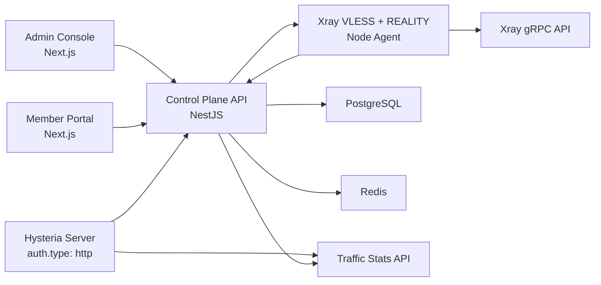

<div align="center">

# Hysteria 2 Control Plane

一个支持 Hysteria 2 与 VLESS + REALITY 的多用户会员管理系统单仓项目，覆盖管理后台、用户中心、节点鉴权/动态用户控制、流量同步和套餐节点分层。

[](https://nextjs.org/)
[](https://nestjs.com/)
[](https://www.prisma.io/)
[](https://www.postgresql.org/)
[](https://redis.io/)
[](https://pnpm.io/)

</div>

---

## 项目定位

Hysteria 2 原生节点可以很快跑起来，但一旦进入多用户、套餐分层、会员到期、流量统计和节点权限管理，就需要一个真正可运营的控制面。这个仓库就是为这件事准备的。

它当前聚焦在三件事：

- 把 Hysteria 2 的接入能力收进可维护的后台
- 把用户、套餐、订阅、节点和流量关系做成完整的数据模型
- 把“交付链接、二维码、配置片段、在线状态、用量同步”串成一条可跑通的链路

## 一眼看懂

| 模块           | 作用                               | 当前状态 |
| -------------- | ---------------------------------- | -------- |
| `apps/web`     | 管理台 + 用户中心                  | 已跑通   |
| `apps/api`     | 控制面 API、鉴权、同步任务         | 已跑通   |
| `packages/ui`  | 主题 token、SCSS 主题层、UI preset | 已落地   |
| `ops/hysteria` | 多套餐端口 / 实例配置样例          | 已提供   |

## 当前能力

### 管理台

- 用户、节点、套餐、套餐绑定、订阅、订单和审计日志的真实 CRUD
- 独立维护会员套餐和流量包商品，支持上下架、定价与有效期配置
- 新建用户后自动签发主访问令牌
- 开通套餐后自动生成专属 URI、二维码和推荐配置片段
- 支持管理员查看接入信息、踢线和用量观察
- 提供余额成交/CDK 权益价值、订单完成率、节点同步健康度和财务 CSV 导出

### 用户中心

- 查看当前套餐状态、到期时间和剩余流量
- 查看接入信息、二维码和配置片段
- 查看订单记录和流量使用情况
- 使用余额或 CDK 自助购买套餐，并在有效套餐上叠加流量包
- 在流量使用达到 80%/95%/100% 或套餐三天内到期时显示分级提醒

### Hysteria 集成

- `POST /integrations/hysteria/auth` 作为 Hysteria `auth.type: http` 后端
- 支持按用户 token 做放行、封禁和剩余流量判断；在线连接仅用于监控，不限制设备数
- 支持 Traffic Stats API 用量读取和在线会话读取

### VLESS + REALITY 集成

- 为每位会员签发独立 VLESS UUID，并生成标准 `vless://` REALITY 订阅节点
- 通过 Xray `HandlerService` 动态增删有效用户
- 通过 Xray `StatsService` 同步用户流量、在线 IP 数和节点健康状态
- 支持后台手动同步、失效会员撤销和踢下线

## 架构概览



## 技术栈

- 前端：Next.js 16、React 19、SCSS
- 后端：NestJS、Prisma
- 数据层：PostgreSQL、Redis
- 工作区：pnpm workspace

## 核心模型

- `users`
- `access_tokens`
- `plans`
- `subscriptions`
- `traffic_packs`
- `manual_orders`
- `nodes`
- `plan_bindings`
- `auth_events`
- `usage_rollups`
- `usage_import_batches`
- `online_snapshots`
- `audit_logs`

## 仓库结构

```text
apps/
  api/        NestJS + Prisma 控制面
  web/        Next.js 管理台 / 用户中心
packages/
  ui/         主题 token、基础样式、UI preset
ops/
  hysteria/   Hysteria 节点配置样例
  xray/       VLESS + REALITY 服务端配置样例
  xray-agent/ Xray 监控与控制代理
```

## 快速开始

### 1. 安装依赖

```bash
pnpm install
```

### 2. 准备环境变量

```bash
copy .env.example .env
copy apps\web\.env.example apps\web\.env.local
```

如果你使用自定义 PostgreSQL / Redis，请把根目录 `.env` 和 `apps/api/.env` 中的连接串改成你的实例地址。

### 3. 启动基础设施

推荐直接使用 Docker：

```bash
docker compose up -d
```

### 4. 初始化数据库

```bash
pnpm --filter @hysteria/api prisma:migrate --name init
pnpm --filter @hysteria/api prisma:seed
```

### 5. 启动服务

```bash
pnpm dev
```

默认地址：

- Web：`http://127.0.0.1:3001/login`
- API：`http://127.0.0.1:4000`
- Health：`http://127.0.0.1:4000/api/health`
- Readiness：`http://127.0.0.1:4000/api/health/ready`

## 本地 seed 账号

这些账号只用于本地开发和演示，生产环境请在初始化后立刻替换：

- 管理员：`ops@hysteria.local / admin123!`
- 会员：`lin@example.com / member123!`

## 常用命令

```bash
pnpm dev
pnpm --filter @hysteria/web lint
pnpm --filter @hysteria/web typecheck
pnpm --filter @hysteria/api test
pnpm --filter @hysteria/api test:e2e
pnpm --filter @hysteria/api build
pnpm --filter @hysteria/web build
pnpm --filter @hysteria/api prisma:migrate --name init
pnpm --filter @hysteria/api prisma:seed
```

## 已验证链路

- 管理员登录
- 新建用户并自动签发主访问令牌
- 新建节点组、节点、套餐和套餐绑定
- 新建订阅并自动展开套餐快照
- 新建人工订单并叠加流量包
- 上架流量包商品并通过余额购买即时到账
- 会员登录并查看接入信息、订单和剩余流量
- 新建会员令牌通过 Hysteria 鉴权接口放行

## Hysteria 接入说明

项目默认按“一个套餐绑定一个节点组，一个节点组下可挂多个端口或实例”的方式组织：

- Hysteria 服务端使用 `auth.type: http`
- 控制面通过 `POST /integrations/hysteria/auth` 决定是否放行
- 每个用户使用独立 token，而不是共享单一口令
- 套餐限速更适合通过不同端口 / 实例的固定 `bandwidth` 实现
- Traffic Stats API 用于读取在线数和流量

## VLESS + REALITY 接入说明

节点侧部署和安全注意事项见 [`ops/xray-agent/README.md`](ops/xray-agent/README.md)。控制面启用统一节点同步任务：

```dotenv
NODE_SYNC_ENABLED=true
```

现有 `HYSTERIA_SYNC_ENABLED=true` 仍然兼容，但新部署建议使用协议无关的 `NODE_SYNC_ENABLED`。

## 生产运营

公网部署前必须配置 Redis、生产密钥、HTTPS 来源、迁移、备份和 readiness 探针。完整上线清单、交易接口、持久化流量批次协议、订单导出与恢复演练见 [`docs/PUBLIC_OPERATIONS.md`](docs/PUBLIC_OPERATIONS.md)。

## 公开仓库注意事项

- 当前仓库未附带正式开源许可证，发布前请确认你的授权方式
- 本地 seed 账号和示例节点仅用于开发演示，不应直接作为生产默认值
- 如果你准备公开部署配置，建议移除 `insecure=1` 并改用正式 TLS 或证书指纹校验

## 后续可扩展方向

- 真实支付网关、退款、回调验签与对账
- 持久化邮件/短信通知与通知去重
- 多实例分布式节点同步锁
